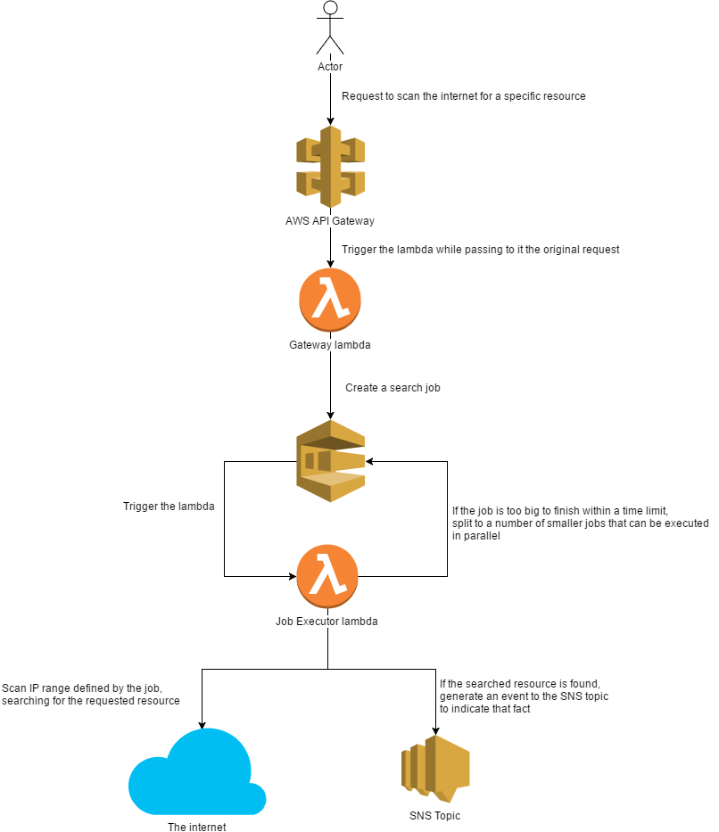

# Notice

While the project is perfectly usable already, the work on this project is still currently ongoing.
The next steps to do:

* update serverless.yml, so that it's AWS account agnostic... at the moment as a shortcut several ARNs are hardcoded
and have to be manually replaced before deployed to any other AWS accounts
* generate a notification once the search is over
* cover by more tests and publish the test coverage
* cache results

[](https://travis-ci.org/kamiljano/pathFinderLambda)

# About

An AWS lambda responsible for scanning the entire internet for a specified HTTP path.
It allows you 

# Why?

Because HACKING. Imagine that you want to quickly list all wordpress applications on the internet
(what can be done by searching for <allIPs>/wp-admin) or that you want to find all git repositories
that have been accidentally updated to the HTTP server and are now available for downloading. These and many
others can be easily achieved simply by requesting a specific http path. 

# Why lambda?

Lambda is an amazing tool in terms of cost saving and scalability. Pay Amazon only what the resources you use
and don't worry about deploying your application and using it only once a year.
Lambda also allows you to drastically scale the application, providing your with up to 4000 instances,
all of which can scan different parts of the internet

# Design



# Run locally

```commandline
serverless invoke local --function find --path requests/exampleDirectRequest.json
```

# Deployment 

**IMPORTANT NOTICE**

**This app is not cheap to run! Thanks to the great scaling capabilities of lambda this approach can squeeze 1 year worth
of computations into 2h, but those are still (depending on the size of the job) potentially around 250k lambda invocations per job!
That multiplied by the required memory can result in several hundreds of USD per single requested job. Speed and scalability comes at a price...**

```commandline
serverless deploy -v
```

# HTTP Requests

The whole process is triggered by an HTTP request with a JSON body.

* from - the IP address that the search should start with
* to - the IP address that the search should end with
* path - the HTTP path that should be checked. For instance if you're interested in checking `http/<generated_id>/test`,
then the path will be `/test`
* regex - optional parameter. Validates that the returned body actually contains what it is expected to contain.
Useful for cases when you want to filter out the fallback pages (like default 404 pages that are still correctly returned event though
the path as such does not match any resource)
* x-amzn-RequestId - a response header uniquely identifying the transaction within which this 
whole request is going to be processed

## Search for all GIT repositories

```
    > POST /dev/find (where 'dev' is the default deployment state generated by the serverless framework)
    > 
    > {
    >   "from": "0.0.0.0",
    >   "to": "255.255.255.255",
    >   "path": "/.git/HEAD",
    >   "regex": "refs/"
    > }
    
    < 202 ACCEPTED
    < x-amzn-RequestId: 250951ab-c624-11e8-99b4-49a117180349
    < {
    <    "message": "The request has been accepted for processing"
    < }
```

## Search for all webstites

```
    > POST /dev/find (where 'dev' is the default deployment state generated by the serverless framework)
    > 
    > {
    >   "from": "0.0.0.0",
    >   "to": "255.255.255.255",
    >   "path": "/"
    > }
    
    < 202 ACCEPTED
    < x-amzn-RequestId: 250951ab-c624-11e8-99b4-49a117180349
    < {
    <    "message": "The request has been accepted for processing"
    < }
```

# Example SNS events

Once the job executor actually finds the requested resource, an SNS event is generated.

```json
    {
      "from": "0.0.0.0",
      "to": "255.255.255.255",
      "path": "/.git/HEAD",
      "regex": "refs/",
      "url": "http://1.2.3.4/.git/HEAD",
      "txId": "250951ab-c624-11e8-99b4-49a117180349"
    }
```

* from - the `from` parameter that the job was triggered with
* to - the `to` parameter that the job was triggered with
* path - the `path` parameter that the job was triggered with
* regex - the `regex` parameter that the job was triggered with
* url - the URL under which the requested resource was found
* txId - the transaction id matching the `x-amzn-RequestId` response header 
that was provided during the original HTTP job creation request.